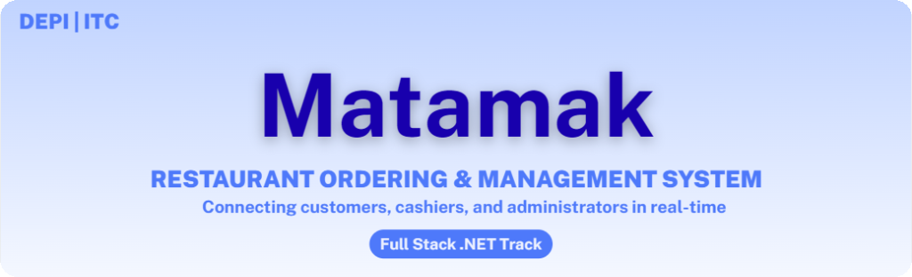
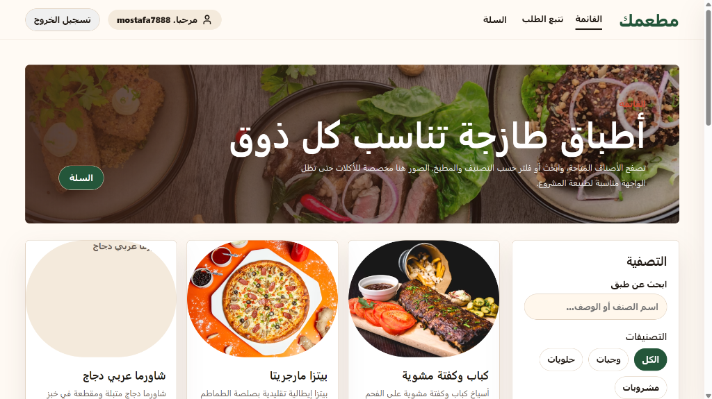
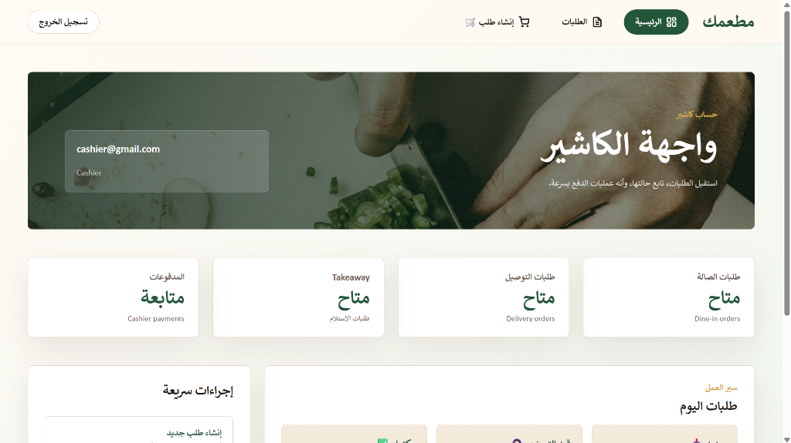
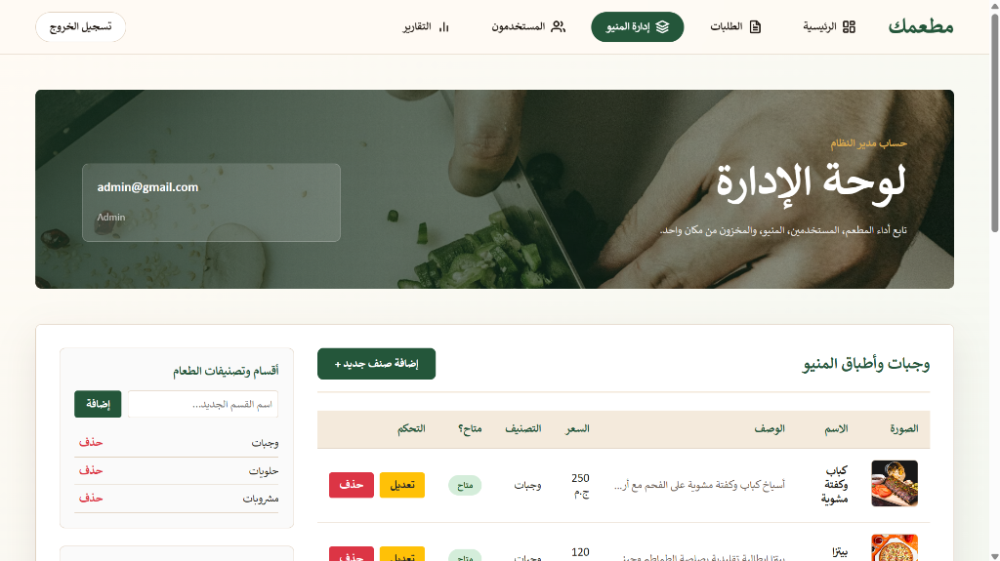

<div align="center">



# 🍽️ Matamak - Restaurant Ordering & Management System

[](https://dotnet.microsoft.com/)
[](https://dotnet.microsoft.com/)
[](https://www.microsoft.com/sql-server)
[](https://angular.dev/)
[](https://www.typescriptlang.org/)
[](https://sass-lang.com/)

Matamak is a comprehensive, modern restaurant ordering and management system designed to digitalize daily food operations. It connects customers, cashiers, and system administrators through a seamless real-time workflow, linking a fully interactive Angular frontend with a robust C# .NET 10 Web API backend.

</div>

---

## 📌 Table of Contents

- [📖 Project Concept](#project-concept)
- [🎯 Project Objectives](#project-objectives)
- [🛠️ Tech Stack & Badges](#tech-stack-badges)
- [✨ Key Features](#key-features)
  - [👤 Customer Experience](#customer-experience)
  - [💼 Staff Experience (Cashier Dashboard)](#staff-experience-cashier-dashboard)
  - [👑 Administrator Panel (Admin Dashboard)](#administrator-panel-admin-dashboard)
- [📂 Folder Structure](#folder-structure)
- [📥 Installation & Setup Guide](#installation-setup-guide)
  - [📋 Prerequisites](#prerequisites)
  - [🚀 Step-by-Step Installation](#step-by-step-installation)
  - [🔑 Seeded Accounts for Testing](#seeded-accounts-for-testing)
- [🖼️ Project Screenshots](#project-screenshots)
- [⚠️ Challenges Faced & Resolutions](#challenges-faced-resolutions)
- [🔮 Future Improvements](#future-improvements)
- [👥 Team Members](#team-members)
- [🎥 Explanatory Video](#explanatory-video)
- [💖 Acknowledgements](#acknowledgements)


---

## <a id="project-concept"></a> 📖 Project Concept

The core idea behind **Matamak** is to build a unified platform that manages the entire lifecycle of restaurant orders. Customers can browse menus, apply discounts, make secure online payments, and track their order status in real time. Staff (cashiers) can manage and process dine-in, takeaway, or delivery orders, while admins manage inventory, analyze sales reports, and configure system settings. All of these features are fully implemented and interactive across both the frontend application and the backend API.

---

## <a id="project-objectives"></a> 🎯 Project Objectives

- **Seamless Operations**: Automate dine-in, takeaway, and delivery order workflows.
- **Real-Time Coordination**: Provide immediate status updates for orders using WebSockets.
- **Secure Authorization**: Implement role-based access control (RBAC) separating Customers, Cashiers, and Admins.
- **Modern Interface**: Provide an intuitive, responsive, and aesthetically pleasing user experience.
- **Online Payment Integration**: Enable online payment workflows through payment gateway simulation (Paymob).

---

## <a id="tech-stack-badges"></a> 🛠️ Tech Stack & Badges

| Component              | Technologies & Tools                                                                                                                                                                                                                                                                                                                                                                                                                                                                                                                                                                                                                                                                                                                                                                                                                                                                                                                                                                             |
| :--------------------- | :----------------------------------------------------------------------------------------------------------------------------------------------------------------------------------------------------------------------------------------------------------------------------------------------------------------------------------------------------------------------------------------------------------------------------------------------------------------------------------------------------------------------------------------------------------------------------------------------------------------------------------------------------------------------------------------------------------------------------------------------------------------------------------------------------------------------------------------------------------------------------------------------------------------------------------------------------------------------------------------------- |
| **Backend & Database** |          |
| **Frontend**           |                                                                                                                                                                                                                                                                                                                                                                     |
| **Development Tools**  |                                                                                                                                                                                                                                                                                                                                                                                                                                                                                                                                                            |

---

## <a id="key-features"></a> ✨ Key Features

### <a id="customer-experience"></a> 👤 Customer Experience

- **Online Ordering**: Place Takeaway or Delivery orders with custom notes and totals.
- **Menu Browsing**: Filter meals by Category or Country/Cuisine of origin, with real-time text search.
- **Order History & Tracking**: Check past transactions, real-time statuses, and unique sequential order tracking IDs.
- **Takeaway Cancellations**: Direct order cancellation ("إلغاء الطلب") option from the customer profile page.
- **Account Control**: Login, Sign-Up, and OTP verification (email-based) for account activation or password resets.

### <a id="staff-experience-cashier-dashboard"></a> 💼 Staff Experience (Cashier Dashboard)

- **Orders Workflow Management**: View and update live orders categorized by Dine-In, Takeaway, and Delivery.
  - _Delivery_: Advance status from _Pending_ ➡️ _With Driver_ ➡️ _Completed_, or cancel the order.
  - _Dine-In_: Live table tracking and status transitions (_Pending_ ➡️ _Cooking_ ➡️ _Served_ ➡️ _Completed_).
  - _Takeaway_: Track, update status, and cancel pickup orders.
- **Express Checkout**: Open customer menus and place rapid orders from the desk.
- **Non-Destructive Cancellations**: Cancelling a takeaway order updates its status to "Canceled" dynamically rather than deleting it from the system, preserving records.

### <a id="administrator-panel-admin-dashboard"></a> 👑 Administrator Panel (Admin Dashboard)

- **Menu Management**: Fully interactive interface to view, add, edit, and delete food items, categories, and countries/cuisines. Supports uploading actual image files directly which are saved on the server and displayed dynamically across the app.
- **User & Staff Account Control**: Retrieve list of all registered Admins, Cashiers, and Customers, create new Manager/Cashier accounts, or delete any account.
- **Sales Analytics & Reports**: Specialized reports dashboard with date-range filters calculating total revenue and successful transaction counts from paid/completed orders.
- **Coupon & Offers Manager**: Administer flat or percentage discount coupon codes.

---

## <a id="folder-structure"></a> 📂 Folder Structure

```text
Matamak/
├── Core/                       # Application Contracts & Domain Layer (Domain & Contracts)
│   ├── DTO/                    # Data Transfer Objects
│   ├── IReprosatory/           # Repository Interfaces
│   ├── IServices/              # Service Interfaces
│   ├── Models/                 # Database Entity Models
│   └── ModelView/              # View Model representations
├── Infrastructure/             # Core Implementation Detail Layer (EF Core, Migrations, etc.)
│   ├── Context/                # EF DataContext (SQL Server Configuration)
│   ├── Migrations/             # EF Code-First Migration Scripts
│   ├── Reprosatory/            # Repository Implementations
│   └── Services/               # Third-party integrations (Paymob, Email, SignalR)
├── Resturant/                  # Web API Project (System Entry Point)
│   ├── Controllers/            # API Endpoints
│   ├── Properties/             # Launch settings & IIS configurations
│   ├── Program.cs              # Dependency Injection & Middleware Pipeline (DI & Middleware)
│   └── appsettings.json        # Database Connection Strings & API Keys
└── Matamak.Frontend/           # Angular Client Application
    ├── src/
    │   ├── app/
    │   │   ├── core/           # Auth, Services, Guards, and Global Interceptors
    │   │   ├── features/       # Feature modules (Auth, Customer, Staff Dashboard)
    │   │   └── shared/         # Reusable layouts, UI Components, and Pipes
    │   └── environments/       # Environment configurations (Dev & Production)
    └── proxy.conf.json         # API reverse proxy configuration for development
```

---

## <a id="installation-setup-guide"></a> 📥 Installation & Setup Guide

Follow these steps to clone the repository and run the Matamak system locally.

### <a id="prerequisites"></a> 📋 Prerequisites

Ensure you have the following installed on your machine:

- **Operating System**: Windows 10/11
- **.NET 10 SDK**: [Download .NET 10 SDK](https://dotnet.microsoft.com/download/dotnet/10.0)
- **Node.js** (LTS version): [Download Node.js](https://nodejs.org/)
- **SQL Server** (LocalDB or standard instance)
- **Git**: [Download Git](https://git-scm.com/)

---

### <a id="step-by-step-installation"></a> 🚀 Step-by-Step Installation

#### 1. Clone the Repository

Clone the project from GitHub and navigate into the root directory:

```bash
git clone https://github.com/YOUR_GITHUB_USERNAME/Matamak.git
cd Matamak
```

#### 2. Apply Database Migrations & Seed Data

Matamak uses Entity Framework Core with Code-First approach. Make sure SQL Server is running locally.

1. **Install the EF Core CLI tools globally** (if not installed):
   ```bash
   dotnet tool install --global dotnet-ef
   ```
2. **Apply migrations** to create the database schema and seed default menu items:
   ```bash
   dotnet ef database update --project Infrastructure --startup-project Resturant
   ```
   > [!NOTE]
   > The default connection string targets local DB (`(localdb)\mssqllocaldb`). If you use a customized SQL Server instance, edit the `DefaultConnection` string in the backend [appsettings.json](file:///C:/Users/mos18/.gemini/antigravity/scratch/Matamak/Resturant/appsettings.json) file before running this command.

---

#### 3. Run the Backend (ASP.NET Core Web API)

You can run the backend API using **Visual Studio** or the **.NET CLI**.

- **Option A: Via Visual Studio (Recommended)**
  1. Open the solution file `Matamak.sln` in Visual Studio 2022.
  2. Set **Resturant** as the startup project.
  3. Select **IIS Express** from the run configurations dropdown.
  4. Run/Debug (Press `F5`).
  5. The API will be hosted on `https://localhost:44357` (pre-configured to match the frontend reverse proxy port).

- **Option B: Via .NET CLI**
  1. Open a terminal at the project root directory.
  2. Run the command:
     ```bash
     dotnet run --project Resturant
     ```
  3. Take note of the CLI port (typically `5270` or `7092`). If it differs from `44357`, update the target port in the frontend reverse proxy file: [proxy.conf.json](file:///C:/Users/mos18/.gemini/antigravity/scratch/Matamak/Matamak.Frontend/proxy.conf.json).

---

#### 4. Run the Frontend (Angular)

1. Open a terminal and navigate to the Angular client folder:
   ```bash
   cd Matamak.Frontend
   ```
2. Install the node packages:
   ```bash
   npm install
   ```
3. Start the local development server:
   ```bash
   npm start
   ```
4. Open your browser and navigate to `http://localhost:4200` to interact with the system.

---

### <a id="seeded-accounts-for-testing"></a> 🔑 Seeded Accounts for Testing

On startup, the system automatically seeds administrative and testing accounts:

| Role                      | Email               | Password    |
| :------------------------ | :------------------ | :---------- |
| **Administrator (Admin)** | `admin@gmail.com`   | `123456789` |
| **Cashier (Staff)**       | `cashier@gmail.com` | `147258369` |

---

## <a id="project-screenshots"></a> 🖼️ Project Screenshots

<div align="center">

### <a id="customer-experience"></a> 👤 Customer Experience

_Customer Menu Page_


---

### 💼 Staff & Cashier Interface

_Cashier Dashboard_


_Cashier Order Placement Screen_


---

### 👑 Administrator Panel

_Admin Dashboard Overview_


_Menu Management_


</div>

---

## <a id="challenges-faced-resolutions"></a> ⚠️ Challenges Faced & Resolutions

- **API Crash on Empty Tables**: Resolved backend unhandled exceptions when requesting menu items from an empty database by replacing exception throwing with empty list returns in the repository and service layers.
- **Admin Dashboard Mockup Shell**: Connected the frontend shell dashboard to active endpoints by writing CRUD logic for items/categories/countries in `CatalogService`, user account list queries in `AuthService`, and order state transitions, inventory updates, and reports fetching in `OrderService`.
- **EF Core Pending Model Changes**: Managed Entity Framework migration discrepancies when new fields were added without migrations by adding a unified `UpdatePendingModelChanges` migration.
- **CORS Restrictions**: Resolved cross-origin requests between the local Angular application (`localhost:4200`) and the ASP.NET Core API server by configuring permissive CORS middleware in `Program.cs`.
- **Swagger Endpoint Collisions**: Encountered ASP.NET Core HTTP 500 routing/Swashbuckle schema errors due to duplicate HTTP verb attributes on single controller actions. Resolved by segregating actions and applying unique route mappings.
- **Dynamic Menu Image Uploading & Rendering**: Fixed an issue where the Angular frontend ignored dynamically uploaded item images and defaulted to random Unsplash placeholders. Created a direct multipart-form image upload endpoint on the backend saving to `wwwroot/uploads`, and adjusted the frontend templates/components to dynamically parse and display this direct path (`imageUrl`).
- **Non-Destructive Takeaway Cancellations**: Initially, takeaway order cancellations deleted order records from the UI and database. Refactored the workflow to execute a soft state change (`Canceled`), and adjusted authorization rules on the endpoint so that standard `Customer` users can only request a cancellation, while `Admin` and `Cashier` roles can update orders to any state.
- **Zero Sales/Profit Analytics Calculations**: Resolving empty analytics results due to the database payment records table being unpopulated. Refactored the dashboard sales reports calculation logic to query total revenue and total counts directly from all successful orders (`Paid`, `Completed`, `Delivered`).
- **Resetting Order Identifiers**: Fixed order tracking sequences resetting to `#1` on fresh sessions or daily rolls by replacing temporary UI sequence counters with database-generated auto-incremented primary keys (`id`).

---

## <a id="future-improvements"></a> 🔮 Future Improvements

- **Advanced Reports Visualizer**: Integrate Chart.js or D3.js in the frontend to visualize sales statistics.
- **Dockerization**: Create Docker files for backend, frontend, and SQL Server to allow single-command deployment.
- **CI/CD Pipeline**: Build GitHub Actions workflows for automated code testing and linting.
- **Refactoring Database Schemas**: Clean up minor database schema naming conventions (e.g., correcting spelling of `Delivary`, `Oredr`, and `Reprosatory`).

---

## <a id="team-members"></a> 👥 Team Members

- **Mostafa Mahmoud Amin** - _Project Lead & Full Stack Developer_
- **Zyad Ayman Abdel-Salam** - _Full Stack Developer_
- **Ahmed Mohamed Abdullah** - _System Analyst_
- **Ibrahim Medhat Abbas** - _DB Adminstrator_
- **Belal Muhammad Abdo** - _Frontend Developer_

---

## <a id="explanatory-video"></a> 🎥 Explanatory Video

Watch the comprehensive video walkthrough explaining the project features and code structure:

🔗 **[Watch Project Explanatory Video](https://drive.google.com/file/d/1vzcUd504_-6dpp0o9l5K4lWh8LzshTWL/view?usp=drive_link)**

---

<div align="center">

> We sincerely thank the **Digital Egypt Pioneers Initiative (DEPI)** and the **Information Technology Colleague (ITC)** for their valuable support and guidance throughout the development of this project.

</div>
